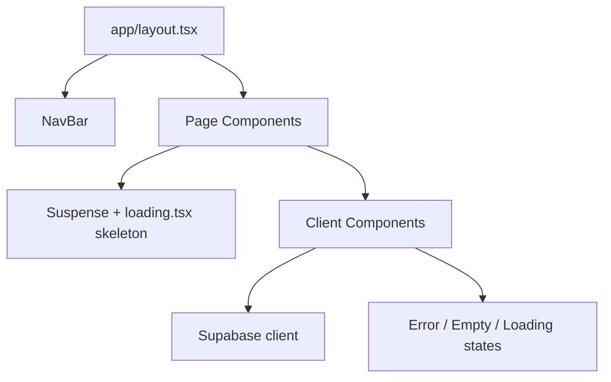

# Design Document: App Polish

## Overview

This document describes the technical design for the app-polish pass on Studio Architect. The goal is to bring the existing Next.js 14 / Tailwind / Supabase application to a finished, professional quality by addressing visual consistency, loading/error/empty states, navigation clarity, form UX, responsive design, accessibility, and micro-interactions.

The work is primarily additive — modifying existing components and pages rather than introducing new data models or API routes. The design is organized around the nine requirement areas and describes the specific changes needed in each file.

---

## Architecture

The app follows a standard Next.js 14 App Router architecture:

- **Server Components** (`app/**/page.tsx`, `app/**/loading.tsx`) handle data fetching and page-level structure.
- **Client Components** (`components/*.tsx`) handle interactivity, form state, and optimistic updates.
- **Suspense boundaries** in page components wrap async server components with skeleton fallbacks.
- **Tailwind CSS** provides all styling via utility classes.

The polish work touches all three layers but introduces no new routes, no new database tables, and no new API endpoints.



---

## Components and Interfaces

### 1. Design System Tokens (Tailwind classes)

Rather than a separate token file, the design system is enforced through consistent Tailwind class strings applied uniformly. The canonical classes are:

| Element | Class string |
|---|---|
| Page title | `text-2xl font-semibold text-gray-900` |
| Section heading | `text-lg font-semibold` |
| Body / label | `text-sm` |
| Page container | `mx-auto max-w-3xl px-6 py-10` |
| Primary button | `rounded-md bg-indigo-600 px-4 py-2 text-sm font-medium text-white hover:bg-indigo-700 focus:outline-none focus:ring-2 focus:ring-indigo-500 disabled:opacity-50 transition-colors` |
| Secondary button | `rounded-md border border-gray-300 bg-white px-4 py-2 text-sm font-medium text-gray-700 hover:bg-gray-50 focus:outline-none focus:ring-2 focus:ring-indigo-500 transition-colors` |
| Text input | `block w-full rounded-md border border-gray-300 px-3 py-2 text-sm shadow-sm focus:outline-none focus:ring-2 focus:ring-indigo-500 focus:border-transparent` |
| Card | `rounded-lg border border-gray-100 bg-white p-4` |
| Interactive card | `rounded-lg border border-gray-100 bg-white p-4 hover:shadow-sm transition-shadow` |
| Empty state text | `text-sm text-gray-500` |

Pages that currently deviate (e.g. `app/lessons/new/page.tsx` uses `max-w-2xl px-4`, profile page uses `max-w-lg px-4`) will be updated to `max-w-3xl px-6 py-10`.

### 2. NavBar

**File:** `components/NavBar.tsx`

Changes:
- Accept a `pathname` prop (or use `usePathname()` internally) to highlight the active link.
- Add a role badge: `<span className="rounded-full bg-indigo-100 px-2 py-0.5 text-xs font-medium text-indigo-700 capitalize">{role}</span>` next to the app name.
- Collapse action links on mobile using `sm:flex hidden` / responsive classes.

```tsx
interface NavBarProps {
  role?: 'teacher' | 'student' | null
}
```

### 3. Breadcrumb Component

**File:** `components/Breadcrumb.tsx` (new)

A simple reusable breadcrumb link:

```tsx
interface BreadcrumbProps {
  href: string
  label: string  // e.g. "← Back to students" or "← Back to [name]"
}
```

Used on:
- `app/progress/[studentId]/page.tsx` — "← Back to students" → `/dashboard`
- `app/lessons/new/page.tsx` and `app/lessons/[id]/edit/page.tsx` — "← Back to [student name]" → `/progress/[studentId]`
- `app/students/[studentId]/profile/page.tsx` — "← Back to [student name]" → `/progress/[studentId]`

### 4. Skeleton Components

**Files:** `app/dashboard/loading.tsx`, `app/progress/[studentId]/loading.tsx`

The dashboard skeleton already exists with 4 placeholder rows. It needs to be updated to match the new consistent container class (`max-w-3xl px-6 py-10`) and include 3–5 rows.

The progress skeleton needs to be updated to include three distinct sections: profile header placeholder, repertoire section placeholder, and lesson notes placeholder.

### 5. EmptyState Component

**File:** `components/EmptyState.tsx` (new)

```tsx
interface EmptyStateProps {
  message: string
  action?: { label: string; href?: string; onClick?: () => void }
}
```

Renders:
```tsx
<div className="py-8 text-center">
  <p className="text-sm text-gray-500">{message}</p>
  {action && ...}
</div>
```

Used in: `StudentList`, `ProgressTree` (repertoire, theory, lesson notes sections), `AssignmentList`.

### 6. Spinner Component

**File:** `components/Spinner.tsx` (new)

A small inline animated SVG spinner, used in:
- `RepertoireCatalogSearch` (already has one inline — extract to component)
- Submit buttons in loading state

### 7. CharacterCount Component

**File:** `components/CharacterCount.tsx` (new)

```tsx
interface CharacterCountProps {
  current: number
  max: number
}
// Renders: "42 / 500" in text-xs text-gray-400
```

Used in `ProfileForm` below the Goals textarea.

### 8. ProfileForm

**File:** `components/ProfileForm.tsx`

Changes:
- Add `CharacterCount` below the goals textarea (max 500).
- Add `maxLength={500}` to the textarea.
- Move focus to first error field on validation failure (goals is the only validated field currently; add focus ref).
- Success banner auto-dismisses after 3 seconds using `useEffect` + `setTimeout`.

### 9. CatalogItemForm

**File:** `components/CatalogItemForm.tsx`

Changes:
- Add `autoFocus` to the title input.
- On validation error, move focus to the first invalid field using a `ref`.
- Add animated spinner to the submit button when `status === 'submitting'`.
- Success banner auto-dismisses after 3 seconds.

### 10. LessonEntryForm

**File:** `components/LessonEntryForm.tsx`

Changes:
- Add `useBeforeUnload` hook that fires a browser confirmation dialog when there are unsaved changes (content or tags differ from initial values).
- Add animated spinner to the Save button when `saving === true`.
- On validation error, move focus to the first invalid field.

### 11. AssignmentForm

**File:** `components/AssignmentForm.tsx`

Changes:
- Add `placeholder="Optional due date"` to the date input (note: `<input type="date">` placeholder is not shown in all browsers; use `aria-label` and a visible hint label instead).
- Ensure touch targets are ≥ 44px.

### 12. AssignmentList

**File:** `components/AssignmentList.tsx`

Changes:
- Replace the bare `<p>` empty state with `<EmptyState>` component.
- Add CSS transition classes to assignment items for the "mark done" animation (fade-out via `transition-opacity duration-200`).
- Role-specific empty state messages: students see "No active assignments — great work!", teachers see "No practice assignments assigned yet."

### 13. ProgressTree

**File:** `components/ProgressTree.tsx`

Changes:
- Replace bare `<p>` empty states with `<EmptyState>` component.
- Add visual confirmation (checkmark flash) after a successful status update — a brief `✓` icon that appears for 1.5s using local state.
- Ensure `updateError` uses `role="alert"`.

### 14. RepertoireCatalogSearch

**File:** `components/RepertoireCatalogSearch.tsx`

Changes:
- The no-results message must include the query: `No results found for "${query}"`.
- Extract the spinner to use the shared `<Spinner>` component.
- Ensure the error message has `role="alert"`.

### 15. Page Metadata

Each page exports a `metadata` object (or `generateMetadata` for dynamic pages):

| Page | Title |
|---|---|
| `/dashboard` | `My Students — Studio Architect` |
| `/progress/[studentId]` | `Progress Tree — Studio Architect` |
| `/lessons/new` | `New Lesson — Studio Architect` |
| `/lessons/[id]/edit` | `Edit Lesson — Studio Architect` |
| `/catalog/new` | `Add to Catalog — Studio Architect` |
| `/students/[studentId]/profile` | `Student Profile — Studio Architect` |

---

## Data Models

No new database tables or schema changes are required. All changes are UI-layer only.

The only data-adjacent change is the 500-character maximum on `student_profiles.goals`, which is enforced client-side in `ProfileForm` via `maxLength={500}`. The existing DB column is `text` with no length constraint; the limit is a UX constraint only.

---

## Correctness Properties

*A property is a characteristic or behavior that should hold true across all valid executions of a system — essentially, a formal statement about what the system should do. Properties serve as the bridge between human-readable specifications and machine-verifiable correctness guarantees.*

### Property 1: Form data is preserved on failed submission

*For any* set of valid form field values entered by a user, if the form submission fails (network error or server error), the form fields SHALL still contain the same values after the failure.

**Validates: Requirements 3.2**

### Property 2: Optimistic update reverts on network failure

*For any* repertoire item with a given status, if a status-change network call fails, the item's displayed status SHALL revert to its original value and an inline error message SHALL be visible.

**Validates: Requirements 3.4**

### Property 3: Error messages use role="alert"

*For any* component that renders an error message, the error container element SHALL have `role="alert"` so screen readers announce it.

**Validates: Requirements 3.5, 8.7**

### Property 4: No-results message includes the search query

*For any* non-empty search query string that returns zero results, the displayed no-results message SHALL contain that exact query string.

**Validates: Requirements 4.5**

### Property 5: Breadcrumb links contain the student name

*For any* student name, the breadcrumb link rendered on the Lesson Form page and the Profile Form page SHALL contain that student's name in its visible text.

**Validates: Requirements 5.3, 5.4**

### Property 6: Page titles contain "Studio Architect"

*For any* page in the application, the exported `metadata.title` string SHALL contain the substring "Studio Architect".

**Validates: Requirements 5.6**

### Property 7: Goals character count matches input length

*For any* string entered into the Goals textarea in ProfileForm, the displayed character count SHALL equal the length of that string.

**Validates: Requirements 6.3**

### Property 8: Form inputs have associated labels

*For any* form input (`<input>`, `<select>`, `<textarea>`) rendered in a form component, there SHALL exist a `<label>` element whose `htmlFor` attribute matches the input's `id`.

**Validates: Requirements 8.2**

### Property 9: Icon-only buttons have aria-labels

*For any* button that contains only an icon (no visible text), the button element SHALL have a non-empty `aria-label` attribute.

**Validates: Requirements 8.3**

---

## Error Handling

### Page-level errors

Currently, page-level data fetch failures in server components silently return empty arrays (e.g. `getStudents` returns `[]` on error). This needs to change:

- Introduce an `ErrorBoundary`-style pattern using Next.js `error.tsx` files at the route segment level.
- `app/dashboard/error.tsx` — renders an error card with a "Try again" button that calls `reset()`.
- `app/progress/[studentId]/error.tsx` — same pattern.

Alternatively, for the `ProgressContent` async server component wrapped in Suspense, errors can be caught and re-thrown to trigger the error boundary.

### Form-level errors

All forms already have error state. The polish work ensures:
- Error banners appear above the submit button (not below).
- Error text is specific (e.g. "Failed to save lesson. Check your connection and try again." rather than "Something went wrong.").
- Errors use `role="alert"`.

### Optimistic update errors

`ProgressTree` and `AssignmentList` already implement optimistic updates with revert-on-failure. The polish work ensures:
- The error message appears inline near the affected item (not at the top of the page).
- The error message is specific.

---

## Testing Strategy

This feature is primarily UI polish — visual consistency, CSS classes, accessibility attributes, and state management. The testing approach uses:

**Unit / component tests** (Vitest + Testing Library):
- Test specific behaviors: empty states render correct messages, error states show `role="alert"`, loading states show skeletons, form data is preserved on failure.
- Focus on the properties identified above.

**Property-based tests** (fast-check, already in devDependencies):
- Used for the properties where input variation matters: character count accuracy, no-results message content, breadcrumb name inclusion, form data preservation.

**Smoke / visual tests** (manual):
- Responsive layout, CSS class consistency, color contrast, focus ring visibility, animation smoothness.

### Property test configuration

Each property test runs a minimum of 100 iterations. Tests are tagged with a comment referencing the design property.

```ts
// Feature: app-polish, Property 4: No-results message includes the search query
fc.assert(fc.property(fc.string({ minLength: 1 }), (query) => {
  // render RepertoireCatalogSearch in no-results state with given query
  // assert displayed text contains query
}), { numRuns: 100 })
```

### Test file locations

| Test file | Covers |
|---|---|
| `components/RepertoireCatalogSearch.test.tsx` | Properties 3, 4; empty/error/loading states |
| `components/ProfileForm.test.tsx` | Properties 1, 7, 8; character count, focus management |
| `components/CatalogItemForm.test.tsx` | Properties 1, 8, 9; auto-focus, loading state |
| `components/ProgressTree.test.tsx` | Properties 2, 3, 9; optimistic revert, empty states |
| `components/AssignmentList.test.tsx` | Properties 2, 3; optimistic revert, empty states |
| `components/NavBar.test.tsx` | Property 9; role badge, active link |
| `app/**/page.test.tsx` | Property 6; page title metadata |
