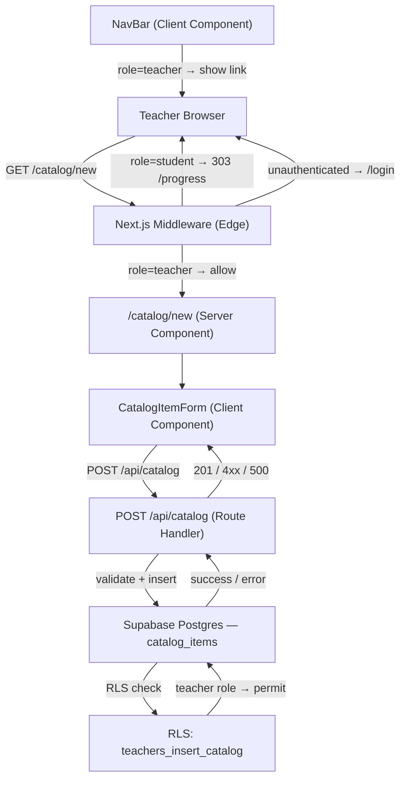

# Design Document: Catalog Management

## Overview

This feature adds a teacher-only UI for adding new `catalog_items` (repertoire pieces and theory assignments) to the shared catalog. Currently, catalog items can only be inserted via SQL. The feature introduces:

- A new page at `/catalog/new` with a `CatalogItemForm` component
- A new `POST /api/catalog` Route Handler that validates and persists items
- A new Supabase RLS insert policy scoped to the teacher role
- A database migration adding the insert policy
- A navigation link in `NavBar` visible only to teachers

The feature integrates cleanly with the existing `catalog_items` table and `GET /api/catalog/search` endpoint — no schema changes are needed beyond the new RLS policy.

---

## Architecture



### Request Lifecycle

1. Teacher navigates to `/catalog/new`. Middleware validates the JWT, checks `app_metadata.role === 'teacher'`, and allows the request through.
2. The Server Component renders the page shell; `CatalogItemForm` is a Client Component that owns all form state.
3. On submit, the form POSTs to `/api/catalog` with `{ title, type, composer }`.
4. The Route Handler re-validates the session server-side, validates the payload, and calls Supabase with the server client (which carries the user's JWT so RLS applies).
5. Supabase evaluates the `teachers_insert_catalog` RLS policy — permits if `app_metadata.role = 'teacher'`.
6. On success, the API returns `201` with the new item; the form resets and shows a confirmation banner.
7. The new item is immediately available in `GET /api/catalog/search` because the `search_vector` generated column is populated at insert time.

---

## Components and Interfaces

### Middleware update (`middleware.ts`)

Add `/catalog/new` to the teacher-only route guard:

```typescript
function isTeacherOnlyRoute(pathname: string): boolean {
  if (pathname === "/lessons/new") return true
  if (/^\/lessons\/[^/]+\/edit$/.test(pathname)) return true
  if (pathname === "/catalog/new") return true   // ← new
  return false
}
```

No other middleware changes are needed — the existing unauthenticated redirect and student-role redirect logic already handles the new route correctly.

### Catalog Admin Page (`app/catalog/new/page.tsx`)

Server Component. Validates the session (redundant safety check after middleware) and renders the form.

```typescript
export default async function CatalogNewPage(): Promise<JSX.Element>
```

### CatalogItemForm (`components/CatalogItemForm.tsx`)

Client Component. Owns all form state and submission logic.

```typescript
interface CatalogItemFormProps {}  // no props needed — self-contained

// Internal state
type FormState = {
  title: string
  type: "repertoire" | "theory" | ""
  composer: string
}

type SubmitState =
  | { status: "idle" }
  | { status: "submitting" }
  | { status: "success"; item: CatalogItem }
  | { status: "error"; message: string }
```

Responsibilities:
- Controlled inputs for `title`, `type` (select), `composer`
- Client-side validation: `title` must be non-empty/non-whitespace; `type` must be selected
- POST to `/api/catalog` on valid submit
- On success: reset form to empty defaults, show confirmation banner with item title
- On error: display error message, preserve form data

### Catalog API Route Handler (`app/api/catalog/route.ts`)

```typescript
export async function POST(request: NextRequest): Promise<NextResponse>
```

Responsibilities:
1. Create a Supabase server client (carries the request cookies / JWT).
2. Call `supabase.auth.getUser()` — reject with `401` if no valid session.
3. Check `user.app_metadata.role === 'teacher'` — reject with `403` if not.
4. Parse and validate the request body: `title` (non-empty string), `type` (`'repertoire'` | `'theory'`), `composer` (optional string).
5. Insert into `catalog_items` via the Supabase client (RLS applies as a second enforcement layer).
6. Return `201` with the inserted row on success, or `400`/`500` with `{ error: string }` on failure.

```typescript
// Request body
type CreateCatalogItemBody = {
  title: string
  type: "repertoire" | "theory"
  composer?: string
}

// Success response — 201
type CreateCatalogItemResponse = CatalogItem

// Error response — 400 | 401 | 403 | 500
type ErrorResponse = { error: string }
```

### NavBar update (`components/NavBar.tsx`)

The NavBar needs to conditionally render the `/catalog/new` link for teachers. Since NavBar is currently a Client Component with no role awareness, it needs to accept the role as a prop (passed from the Server Component layout).

```typescript
interface NavBarProps {
  role?: "teacher" | "student" | null
}

export default function NavBar({ role }: NavBarProps): JSX.Element
```

The layout (`app/layout.tsx`) fetches the role server-side and passes it to `NavBar`.

---

## Data Models

No new tables or columns are required. The existing `catalog_items` schema handles everything:

| Column | Type | Notes |
|---|---|---|
| `id` | `uuid` | PK, `DEFAULT gen_random_uuid()` — auto-generated |
| `title` | `text NOT NULL` | Provided by teacher |
| `type` | `text NOT NULL CHECK (type IN ('repertoire', 'theory'))` | Provided by teacher |
| `composer` | `text` | Optional; NULL for theory items |
| `search_vector` | `tsvector GENERATED ALWAYS AS (...)` | Auto-populated at insert |

### New RLS Policy (migration)

A new migration adds the teacher insert policy:

```sql
-- Migration: 002_catalog_insert_policy.sql

CREATE POLICY "teachers_insert_catalog" ON public.catalog_items
  FOR INSERT
  WITH CHECK (
    (auth.jwt() -> 'app_metadata' ->> 'role') = 'teacher'
  );
```

This uses `auth.jwt()` to read the role claim directly from the JWT, consistent with how the trigger sets it. The existing `authenticated_read_catalog` SELECT policy is unaffected.

---

## Correctness Properties

*A property is a characteristic or behavior that should hold true across all valid executions of a system — essentially, a formal statement about what the system should do. Properties serve as the bridge between human-readable specifications and machine-verifiable correctness guarantees.*

### Property 1: Middleware enforces teacher-only access to `/catalog/new`

*For any* request to `/catalog/new`, the middleware SHALL allow the request only when the session carries a teacher role — a student-role session SHALL be redirected to the student's progress view, and an unauthenticated request SHALL be redirected to `/login`.

**Validates: Requirements 1.1, 1.2, 1.3**

---

### Property 2: Catalog API rejects non-teacher insert requests

*For any* POST request to `/api/catalog`, the Route Handler SHALL return a `401` or `403` response when the request does not carry an authenticated teacher-role session, regardless of the payload content.

**Validates: Requirements 1.4**

---

### Property 3: Empty or whitespace-only title is always rejected by the form

*For any* string composed entirely of whitespace characters (including the empty string), submitting the Catalog_Form with that value as the title SHALL produce a client-side validation error and SHALL NOT dispatch a network request to the Catalog_API.

**Validates: Requirements 2.5**

---

### Property 4: Catalog item insert round-trip preserves all fields

*For any* valid catalog item payload (arbitrary non-empty title, either type value, optional composer), after a successful POST to `/api/catalog`, reading the inserted row from `catalog_items` SHALL return a record whose `title`, `type`, and `composer` fields are identical to the submitted values, and whose `id` is a valid UUID.

**Validates: Requirements 3.1, 3.2**

---

### Property 5: Form resets to empty defaults after every successful insert

*For any* valid catalog item submission that results in a `201` response, the `CatalogItemForm` SHALL reset all fields (`title`, `type`, `composer`) to their empty default values.

**Validates: Requirements 3.4**

---

### Property 6: Newly inserted item is immediately findable via catalog search

*For any* catalog item successfully inserted via the Catalog_API, a subsequent GET request to `/api/catalog/search?q={title}` SHALL include that item in the results without requiring a cache flush or restart.

**Validates: Requirements 5.1**

---

## Error Handling

### Access Control Errors

| Scenario | Behavior |
|---|---|
| Student accesses `/catalog/new` | Middleware redirects to `/progress/{userId}` with 303 |
| Unauthenticated user accesses `/catalog/new` | Middleware redirects to `/login` |
| Student POSTs to `/api/catalog` | Route Handler returns `403 { error: "Forbidden" }` |
| Unauthenticated POST to `/api/catalog` | Route Handler returns `401 { error: "Unauthorized" }` |

### Validation Errors

| Scenario | Behavior |
|---|---|
| Empty/whitespace `title` | Client-side error shown inline; no API call made |
| Missing `type` selection | Client-side error shown inline; no API call made |
| Invalid `type` value in API body | Route Handler returns `400 { error: "Invalid type" }` |
| Malformed JSON body | Route Handler returns `400 { error: "Invalid request body" }` |

### Persistence Errors

| Scenario | Behavior |
|---|---|
| DB insert fails (network, constraint) | API returns `500 { error: "Failed to insert catalog item" }`; form displays error message and preserves field values |
| RLS policy blocks insert (defense-in-depth) | Supabase returns a policy violation error; API surfaces as `403` |

---

## Testing Strategy

### Unit Tests (example-based)

- `CatalogItemForm` renders all three fields with correct attributes (Req 2.2)
- Selecting `repertoire` type shows composer field as optional (Req 2.4)
- Submitting with empty title shows validation error, no fetch called (Req 2.5)
- Submitting with no type selected shows validation error (Req 2.6)
- Successful submit shows confirmation banner with item title (Req 3.3)
- DB failure response shows error message and preserves form data (Req 3.5)
- `NavBar` renders `/catalog/new` link when `role="teacher"` (Req 6.1)
- `NavBar` does not render `/catalog/new` link when `role="student"` (Req 6.2)

### Property-Based Tests

Using **fast-check** (TypeScript PBT library). Each test runs a minimum of **100 iterations**.

Tag format: `// Feature: catalog-management, Property N: <property_text>`

| Property | Generator | Assertion |
|---|---|---|
| P1: Middleware role enforcement | Arbitrary role values (`teacher`, `student`, `null`) × arbitrary sub-paths | Teacher → allowed; student → 303 to progress; null → redirect to `/login` |
| P2: API rejects non-teacher | Arbitrary payloads × non-teacher auth states (student session, no session) | Always returns `401` or `403` |
| P3: Whitespace title rejected | Arbitrary strings composed of whitespace characters (spaces, tabs, newlines) | Validation error shown; no fetch dispatched |
| P4: Insert round-trip | Arbitrary valid `{ title, type, composer? }` payloads | Retrieved row matches submitted fields; `id` is valid UUID |
| P5: Form reset after success | Arbitrary valid submissions | After `201`, all form fields are empty/default |
| P6: Search finds new item | Arbitrary valid catalog items | After insert, search by title returns the item |

### Integration Tests

- Teacher-role session can insert via `POST /api/catalog`; item appears in `GET /api/catalog/search` (Req 5.1, 5.2)
- Student-role session is blocked by RLS on direct Supabase insert (Req 4.2)
- Unauthenticated request is blocked by RLS (Req 4.3)
- Existing `authenticated_read_catalog` policy still works after migration (Req 4.4)
- `search_vector` is auto-populated on insert (Req 5.3)
