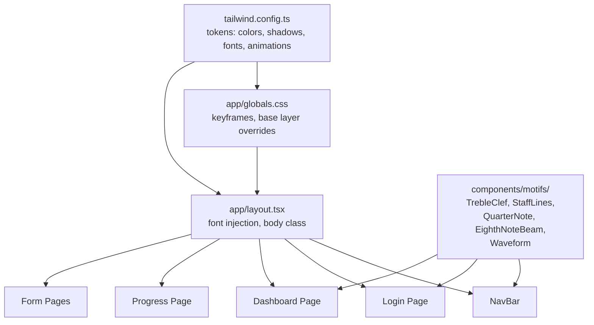

# Design Document: Conservatory Visual Theme

## Overview

This feature transforms Studio Architect from a functional but visually bare prototype into a dramatic, music-themed experience. The approach is "skin and shine" — the data model, routing, and server logic remain untouched. Every visual surface is replaced with a cohesive dark-luxurious identity: near-black warm backgrounds, rich amber/gold accents, luminous cream typography, expressive motion, and music iconography woven throughout.

The implementation is entirely in the presentation layer: `tailwind.config.ts`, `app/globals.css`, `app/layout.tsx`, and the existing page/component files. No new routes, no new API calls, no schema changes.

### Key Design Decisions

- **Tailwind token extension over CSS variables**: All palette values live in `tailwind.config.ts` as named semantic tokens (`studio-bg`, `studio-surface`, etc.). This keeps Tailwind's JIT purging intact and avoids a parallel CSS-variable system.
- **Next.js font optimization**: `next/font/google` loads Cormorant Garamond (display) and Inter (body) with `display: swap` and zero layout shift. Font class names are injected on `<html>` and referenced via `font-display` / `font-body` Tailwind utilities.
- **Inline SVG motifs**: Music motifs are React components returning inline SVG. They inherit `currentColor`, scale without pixelation, and accept `opacity` / `color` props. No external image files.
- **CSS keyframes in globals.css**: `fade-up`, `shimmer`, and `lift` are defined once in `globals.css` and exposed as Tailwind `animation` tokens. The `@media (prefers-reduced-motion: reduce)` block zeroes all durations globally.
- **Stagger via inline style**: The 80ms-per-item stagger is applied as `style={{ animationDelay: \`${index * 80}ms\` }}` on list items — no JS animation library needed.

---

## Architecture

The theme is a pure CSS/config layer sitting on top of the existing Next.js app. No new dependencies are required beyond the fonts already available via `next/font/google`.



The motif components live in `components/motifs/` and are imported directly by the pages/components that need them. There is no motif registry or dynamic loader — just straightforward imports.

---

## Components and Interfaces

### 1. Tailwind Token Extension (`tailwind.config.ts`)

```ts
theme: {
  extend: {
    colors: {
      'studio-bg':      '#0d0a07',   // near-black warm brown
      'studio-surface': '#1c1610',   // card/panel surface
      'studio-rim':     '#2a1f12',   // subtle border/divider
      'studio-primary': '#c8922a',   // rich amber gold (primary actions)
      'studio-gold':    '#e8b84b',   // bright gold accent / highlights
      'studio-cream':   '#f5ead6',   // luminous cream (headings, labels)
      'studio-text':    '#c9b99a',   // warm body text
      'studio-muted':   '#7a6a52',   // muted warm gray
      'studio-rose':    '#c0614a',   // warm error/rose tone
    },
    fontFamily: {
      display: ['var(--font-display)', 'Georgia', 'serif'],
      body:    ['var(--font-body)',    'system-ui', 'sans-serif'],
    },
    boxShadow: {
      'studio-glow':     '0 0 0 1px rgba(200,146,42,0.15), 0 4px 24px rgba(200,146,42,0.18)',
      'studio-glow-lg':  '0 0 0 1px rgba(200,146,42,0.25), 0 8px 40px rgba(200,146,42,0.30)',
    },
    transitionDuration: {
      fast: '150ms',
      base: '250ms',
      slow: '450ms',
    },
    animation: {
      'fade-up':  'fade-up 0.45s ease both',
      'shimmer':  'shimmer 1.6s linear infinite',
    },
    keyframes: {
      'fade-up': {
        '0%':   { opacity: '0', transform: 'translateY(20px)' },
        '100%': { opacity: '1', transform: 'translateY(0)' },
      },
      'shimmer': {
        '0%':   { backgroundPosition: '-200% 0' },
        '100%': { backgroundPosition: '200% 0' },
      },
    },
  },
}
```

### 2. Global CSS (`app/globals.css`)

Responsibilities:
- `@layer base`: set `body { background-color: theme('colors.studio-bg'); color: theme('colors.studio-text'); font-family: var(--font-body); }`
- Shared input styles via `@layer components`: `.studio-input`, `.studio-btn-primary`, `.studio-btn-ghost`
- `@media (prefers-reduced-motion: reduce)`: set `*, *::before, *::after { animation-duration: 0ms !important; transition-duration: 0ms !important; }`

### 3. Layout (`app/layout.tsx`)

Loads fonts via `next/font/google`:
```ts
import { Cormorant_Garamond, Inter } from 'next/font/google'

const displayFont = Cormorant_Garamond({
  subsets: ['latin'], weight: ['400','600','700'],
  variable: '--font-display', display: 'swap',
})
const bodyFont = Inter({
  subsets: ['latin'], variable: '--font-body', display: 'swap',
})
```

Applies `${displayFont.variable} ${bodyFont.variable}` to `<html>` and `bg-studio-bg` to `<body>`.

### 4. Music Motif Components (`components/motifs/`)

Each component has this interface:

```ts
interface MotifProps {
  className?: string
  opacity?: number      // 0–1, default varies by motif
  color?: string        // CSS color string, default 'currentColor'
}
```

All components return an inline SVG with `aria-hidden="true"` and `focusable="false"`.

| File | Motif | Default viewBox |
|------|-------|----------------|
| `TrebleClef.tsx` | Treble clef glyph | `0 0 40 120` |
| `StaffLines.tsx` | 5 horizontal staff lines | `0 0 200 40` |
| `QuarterNote.tsx` | Quarter note (filled head + stem) | `0 0 24 60` |
| `EighthNoteBeam.tsx` | Two eighth notes with beam | `0 0 60 60` |
| `Waveform.tsx` | Abstract sine-wave path | `0 0 200 40` |

### 5. Updated Components

**NavBar**: dark `bg-studio-bg` background, `border-b border-studio-primary/30`, wordmark in `font-display text-xl text-studio-cream`, active link with `border-b-2 border-studio-gold text-studio-gold`, `StaffLines` motif at `opacity-30` in the right gutter.

**Login Page**: full-viewport dark background, `TrebleClef` at `opacity-60` as absolute hero element, heading `font-display text-5xl text-studio-cream tracking-wide`, tagline in `text-studio-muted`, form card `bg-studio-surface shadow-studio-glow`, submit button `bg-studio-primary hover:-translate-y-1 hover:shadow-studio-glow-lg transition-all duration-fast`.

**Dashboard**: `bg-studio-bg`, heading `font-display text-4xl text-studio-cream`, `EighthNoteBeam` + `StaffLines` in header at `opacity-50`, student rows as `bg-studio-surface rounded-2xl shadow-studio-glow hover:-translate-y-1 hover:shadow-studio-glow-lg transition-all duration-base`.

**Progress Page**: same dark background, heading `font-display text-4xl`, status badges use `studio-primary` (introduced), `studio-gold` (developing), `studio-cream` (performance-ready) with dark backgrounds, list items animated with `animate-fade-up` + inline `animationDelay`.

**Form Pages** (LessonEntryForm, CatalogItemForm, ProfileForm): inputs use `.studio-input` class, submit buttons use `.studio-btn-primary`, cancel/ghost actions use `.studio-btn-ghost`.

**Spinner**: `text-studio-gold` replaces `text-current` default.

**EmptyState**: music note icon (inline SVG), `text-studio-muted` text, action link in `text-studio-primary`.

**Loading skeletons** (dashboard/loading.tsx, progress/loading.tsx): shimmer cards using `bg-studio-rim animate-shimmer bg-gradient-to-r from-studio-rim via-studio-surface to-studio-rim bg-[length:200%_100%]`.

---

## Data Models

No new data models. This feature is purely presentational. The only "data" introduced is the design token set in `tailwind.config.ts`, which is build-time configuration.

---

## Correctness Properties

*A property is a characteristic or behavior that should hold true across all valid executions of a system — essentially, a formal statement about what the system should do. Properties serve as the bridge between human-readable specifications and machine-verifiable correctness guarantees.*

The project already has `fast-check` in devDependencies. Tests use Vitest + `@testing-library/react`.

### Property 1: Active nav link styling

*For any* route path that corresponds to a nav link, when the NavBar is rendered with that path as the current route, exactly that link should have the gold active-state classes (`border-studio-gold`, `text-studio-gold`) and no other nav link should have those classes.

**Validates: Requirements 2.4**

### Property 2: Error display uses warm tone

*For any* non-empty error string, when the login form is rendered in an error state with that string, the error element should have a warm-tone class (e.g. `text-studio-rose`) and must not have the class `text-red-600`.

**Validates: Requirements 3.8**

### Property 3: Student cards carry required styling classes

*For any* non-empty list of student records, every rendered student card element should have `bg-studio-surface`, `rounded-2xl`, and `shadow-studio-glow` classes applied.

**Validates: Requirements 4.2**

### Property 4: Status badge color is status-specific

*For any* valid repertoire status value (`introduced`, `developing`, `performance-ready`), the rendered status badge should use the corresponding warm-palette token class, and two different status values should never produce the same class.

**Validates: Requirements 5.4**

### Property 5: Stagger animation delay scales with index

*For any* list of N repertoire items (N ≥ 1), each item at index `i` should have an `animationDelay` inline style of exactly `${i * 80}ms`, so the stagger is proportional to position.

**Validates: Requirements 5.7**

### Property 6: Music motif components are accessible and configurable

*For any* motif type in the required set (TrebleClef, StaffLines, QuarterNote, EighthNoteBeam, Waveform) and *for any* valid opacity value in [0, 1], the rendered SVG element should have `aria-hidden="true"` and the opacity prop should be reflected in the rendered output.

**Validates: Requirements 8.1, 8.2, 8.3**

---

## Error Handling

Since this feature is purely presentational, error handling concerns are limited:

- **Font load failure**: `next/font/google` falls back to the `fontFamily` stack defined in the Tailwind config (`Georgia, serif` for display; `system-ui, sans-serif` for body). The app remains fully functional.
- **SVG rendering**: Motif components are pure functions with no async operations. They cannot fail at runtime. If a prop is invalid (e.g. `opacity > 1`), the SVG renders with the raw value — no crash.
- **Tailwind purge**: All token class names used in JSX must appear as complete strings (not dynamically constructed) so Tailwind's JIT scanner includes them. Dynamic stagger delays use inline `style` rather than dynamic class names to avoid purge issues.
- **Reduced motion**: The `@media (prefers-reduced-motion: reduce)` block in globals.css is a hard override — it does not depend on JS, so it works even if React hydration is delayed.

---

## Testing Strategy

### Unit / Example Tests

These verify specific rendering behavior with concrete inputs:

- NavBar renders wordmark in `font-display` class and includes a motif SVG
- Login page renders heading with `text-5xl font-display`, form card with `shadow-studio-glow`, submit button with `bg-studio-primary`
- Dashboard renders heading with `font-display text-4xl`, includes a motif SVG in the header
- EmptyState renders with `text-studio-muted` and a music icon when no students exist
- Spinner renders with `text-studio-gold`
- Skeleton loading components render with `animate-shimmer` class
- Form inputs render with `.studio-input` class; submit buttons with `.studio-btn-primary`
- `@media (prefers-reduced-motion)` CSS block is present in globals.css output

### Property-Based Tests (fast-check)

Each property test runs a minimum of 100 iterations. Tests are tagged with the property they validate.

**Property 1 — Active nav link styling**
```
// Feature: conservatory-visual-theme, Property 1: active nav link styling
fc.property(fc.constantFrom('/dashboard', '/catalog/new'), (route) => {
  // render NavBar with usePathname mocked to route
  // assert: link for route has gold classes; others do not
})
```

**Property 2 — Error display uses warm tone**
```
// Feature: conservatory-visual-theme, Property 2: error display uses warm tone
fc.property(fc.string({ minLength: 1 }), (errorMsg) => {
  // render LoginPage with error state set to errorMsg
  // assert: error element has text-studio-rose, not text-red-600
})
```

**Property 3 — Student cards carry required styling classes**
```
// Feature: conservatory-visual-theme, Property 3: student card styling
fc.property(fc.array(studentArbitrary, { minLength: 1 }), (students) => {
  // render student list with given students
  // assert: every card element has bg-studio-surface, rounded-2xl, shadow-studio-glow
})
```

**Property 4 — Status badge color is status-specific**
```
// Feature: conservatory-visual-theme, Property 4: status badge color
fc.property(fc.constantFrom('introduced', 'developing', 'performance-ready'), (status) => {
  // render status badge with given status
  // assert: badge has the expected warm-palette class for that status
  // assert: different statuses produce different classes
})
```

**Property 5 — Stagger animation delay scales with index**
```
// Feature: conservatory-visual-theme, Property 5: stagger animation delay
fc.property(fc.array(repertoireItemArbitrary, { minLength: 1, maxLength: 20 }), (items) => {
  // render repertoire list with given items
  // assert: item at index i has animationDelay === `${i * 80}ms`
})
```

**Property 6 — Music motif components are accessible and configurable**
```
// Feature: conservatory-visual-theme, Property 6: motif accessibility and props
fc.property(
  fc.constantFrom('TrebleClef', 'StaffLines', 'QuarterNote', 'EighthNoteBeam', 'Waveform'),
  fc.float({ min: 0, max: 1 }),
  (motifType, opacity) => {
    // render the motif component with given opacity
    // assert: svg has aria-hidden="true"
    // assert: opacity prop is reflected in rendered output
  }
)
```

### Integration / Smoke Tests

- Tailwind config exports all required token keys (`studio-bg`, `studio-surface`, `studio-primary`, `studio-accent`, `studio-text`, `studio-gold`, `studio-glow` shadow, `fade-up` and `shimmer` animations, `font-display` and `font-body` font families)
- `app/globals.css` contains `@media (prefers-reduced-motion: reduce)` block
- `next build` completes without error (no purged classes, no missing font files)
