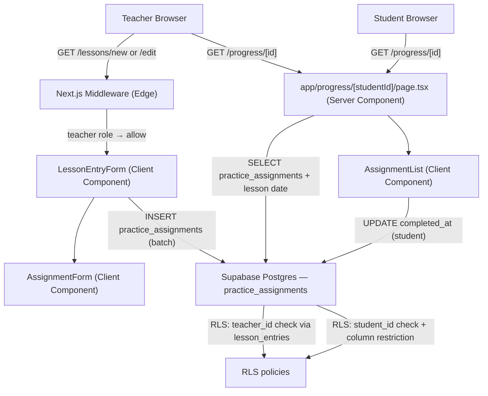

# Design Document: Practice Assignments

## Overview

This feature adds practice assignments to Studio Architect. Teachers compose one or more assignments directly inside the existing `LessonEntryForm`, each with a plain-text description and an optional due date. Assignments are persisted to a new `practice_assignments` table linked to both the lesson entry and the student. Students see their active (incomplete) assignments on the Progress Tree page and can mark them done with a single click. Teachers see all assignments — active and completed — for a student, with the source lesson date visible for traceability.

The changes are additive: one new migration, one new component (`AssignmentForm`), one new client component (`AssignmentList`), targeted modifications to `LessonEntryForm` and the Progress Tree page, and new RLS policies.

### Key Design Decisions

| Decision | Choice | Rationale |
|---|---|---|
| Assignment storage | New `practice_assignments` table | Clean separation from lesson content; independent RLS; queryable without parsing JSONB |
| Assignments saved with lesson | Batch insert on lesson save | Keeps the save flow atomic; no partial state between lesson and assignments |
| Mark-done mutation | Direct Supabase client call from `AssignmentList` | Consistent with existing pattern in `LessonEntryForm`; RLS enforces column restriction at DB layer |
| Optimistic UI on mark-done | Remove from active list immediately, revert on error | Snappy UX; matches requirement 3.3 |
| Teacher vs. student view | Role prop passed to `AssignmentList` | Single component handles both views; avoids duplication |
| Lesson entry date on assignments | JOIN to `lesson_entries.created_at` at query time | No denormalization needed; single query with select |

---

## Architecture



### Request Lifecycle — Saving Assignments

1. Teacher composes a lesson entry and adds assignments via `AssignmentForm`.
2. On "Save Lesson", `LessonEntryForm` first upserts the lesson entry (existing flow), then batch-inserts all non-empty assignments with `lesson_entry_id`, `student_id`, description, and optional `due_date`.
3. On edit, existing assignments for the entry are deleted and re-inserted (replace strategy, consistent with how `repertoire_tags` are handled).
4. RLS on `practice_assignments` verifies `teacher_id` via a JOIN to `lesson_entries`.

### Request Lifecycle — Progress Page

1. Server Component fetches assignments via a JOIN to `lesson_entries` to get the lesson date.
2. For students: only active assignments (`completed_at IS NULL`) are fetched.
3. For teachers: all assignments are fetched, ordered by `completed_at IS NULL DESC, created_at DESC`.
4. `AssignmentList` receives the data and role; students see a "Mark done" button per active assignment.
5. On mark-done: optimistic removal from list → Supabase UPDATE `completed_at = now()` → revert on error.

---

## Components and Interfaces

### `AssignmentForm` (new — `components/AssignmentForm.tsx`)

Client Component embedded inside `LessonEntryForm`. Manages the in-progress list of assignments before the lesson is saved.

```typescript
interface AssignmentDraft {
  key: string          // client-side stable key (crypto.randomUUID())
  description: string
  due_date: string | null  // ISO date string "YYYY-MM-DD" or null
}

interface AssignmentFormProps {
  assignments: AssignmentDraft[]
  onChange: (assignments: AssignmentDraft[]) => void
}
```

Renders a list of draft rows (description input + date input + remove button) and an "Add assignment" button. Validation (non-empty description) is surfaced by the parent `LessonEntryForm` at save time.

### `AssignmentList` (new — `components/AssignmentList.tsx`)

Client Component rendered on the Progress Tree page. Handles display and mark-done interaction.

```typescript
interface AssignmentRow {
  id: string
  description: string
  due_date: string | null       // ISO date string
  completed_at: string | null   // ISO timestamptz string
  lesson_entry_date: string     // ISO timestamptz from lesson_entries.created_at
}

interface AssignmentListProps {
  assignments: AssignmentRow[]
  role: 'teacher' | 'student'
}
```

In student mode: renders only active assignments (those with `completed_at === null`). In teacher mode: renders active and completed in separate sections. Students see a "Mark done" button; teachers see read-only rows.

### `LessonEntryForm` update (`components/LessonEntryForm.tsx`)

Adds `assignments` state (`AssignmentDraft[]`, initially `[]`) and renders `AssignmentForm`. On save, after upserting the lesson entry:

1. If editing: `DELETE FROM practice_assignments WHERE lesson_entry_id = entryId`.
2. Batch-insert all drafts where `description.trim() !== ''`.

If any draft has an empty description, a validation error is shown and the save is aborted before any DB call.

### Progress Tree page update (`app/progress/[studentId]/page.tsx`)

Adds `getAssignmentsData(studentId, role)` alongside the existing `getProgressData`. Passes results to `AssignmentList` rendered below `ProgressTree` in a visually distinct section.

```typescript
async function getAssignmentsData(
  studentId: string,
  role: 'teacher' | 'student'
): Promise<AssignmentRow[]>
```

For students: `.eq('student_id', studentId).is('completed_at', null)`.
For teachers: `.eq('student_id', studentId)` (all assignments).
Both queries join `lesson_entries(created_at)` via the FK.

---

## Data Models

### `practice_assignments` table

| Column | Type | Notes |
|---|---|---|
| `id` | `uuid` | PK, `DEFAULT gen_random_uuid()` |
| `lesson_entry_id` | `uuid` | FK → `lesson_entries.id` ON DELETE CASCADE |
| `student_id` | `uuid` | FK → `profiles.id` ON DELETE CASCADE |
| `description` | `text` | NOT NULL, CHECK `(length(trim(description)) > 0)` |
| `due_date` | `date` | Nullable |
| `completed_at` | `timestamptz` | Nullable; set by client to `now()` on completion |
| `created_at` | `timestamptz` | NOT NULL DEFAULT `now()` |

Indexes: `(student_id, completed_at)` for the student progress page query; `(lesson_entry_id)` for cascade and teacher queries.

### Migration: `004_practice_assignments.sql`

```sql
CREATE TABLE IF NOT EXISTS public.practice_assignments (
  id               uuid        PRIMARY KEY DEFAULT gen_random_uuid(),
  lesson_entry_id  uuid        NOT NULL REFERENCES public.lesson_entries (id) ON DELETE CASCADE,
  student_id       uuid        NOT NULL REFERENCES public.profiles (id) ON DELETE CASCADE,
  description      text        NOT NULL CHECK (length(trim(description)) > 0),
  due_date         date,
  completed_at     timestamptz,
  created_at       timestamptz NOT NULL DEFAULT now()
);

CREATE INDEX IF NOT EXISTS practice_assignments_student_completed_idx
  ON public.practice_assignments (student_id, completed_at);

CREATE INDEX IF NOT EXISTS practice_assignments_lesson_entry_idx
  ON public.practice_assignments (lesson_entry_id);

ALTER TABLE public.practice_assignments ENABLE ROW LEVEL SECURITY;

-- Teachers can SELECT, INSERT, UPDATE assignments on their own lesson entries
CREATE POLICY "teachers_all_own_assignments" ON public.practice_assignments
  FOR ALL
  USING (
    EXISTS (
      SELECT 1 FROM public.lesson_entries le
      WHERE le.id = lesson_entry_id
        AND le.teacher_id = auth.uid()
    )
  )
  WITH CHECK (
    EXISTS (
      SELECT 1 FROM public.lesson_entries le
      WHERE le.id = lesson_entry_id
        AND le.teacher_id = auth.uid()
    )
  );

-- Students can SELECT their own assignments
CREATE POLICY "students_select_own_assignments" ON public.practice_assignments
  FOR SELECT
  USING (student_id = auth.uid());

-- Students can UPDATE only completed_at on their own assignments
CREATE POLICY "students_update_completed_at" ON public.practice_assignments
  FOR UPDATE
  USING (student_id = auth.uid())
  WITH CHECK (student_id = auth.uid());
```

The column-level restriction for students (only `completed_at`) is enforced by granting column-level UPDATE privilege in the migration:

```sql
-- Revoke broad UPDATE, grant only completed_at to authenticated role
REVOKE UPDATE ON public.practice_assignments FROM authenticated;
GRANT UPDATE (completed_at) ON public.practice_assignments TO authenticated;
-- Re-grant full UPDATE to service_role (used by teachers via RLS)
GRANT UPDATE ON public.practice_assignments TO service_role;
```

> Note: Because Supabase uses the `authenticated` role for all logged-in users, column-level grants combined with RLS policies enforce the student restriction. Teachers operate through the same `authenticated` role but their RLS policy (`teachers_all_own_assignments`) covers their entries; the column grant limits what any authenticated user can UPDATE to `completed_at` only. Teachers inserting new assignments use INSERT (not UPDATE), so the column grant does not affect them.

### Updated TypeScript types (`lib/types.ts`)

```typescript
export type AssignmentDraft = {
  key: string
  description: string
  due_date: string | null
}

export type AssignmentRow = {
  id: string
  description: string
  due_date: string | null
  completed_at: string | null
  lesson_entry_date: string
}
```

---

## Correctness Properties

*A property is a characteristic or behavior that should hold true across all valid executions of a system — essentially, a formal statement about what the system should do. Properties serve as the bridge between human-readable specifications and machine-verifiable correctness guarantees.*

### Property 1: Multiple assignments are all held in form state

*For any* sequence of valid assignment descriptions added to the `AssignmentForm`, the resulting `assignments` array SHALL have a length equal to the number of descriptions added, and each description SHALL appear in the array.

**Validates: Requirements 1.4**

---

### Property 2: Add then remove is a round-trip identity

*For any* initial list of assignments and any new assignment added to it, removing that same assignment SHALL return the list to its original state — same length and same contents.

**Validates: Requirements 1.5**

---

### Property 3: Whitespace-only descriptions are rejected

*For any* string composed entirely of whitespace characters, attempting to save a lesson entry containing an assignment with that description SHALL display a validation error and SHALL NOT issue any INSERT to `practice_assignments`.

**Validates: Requirements 1.7**

---

### Property 4: Assignment persistence round-trip

*For any* valid set of assignments (random descriptions, optional due dates), saving a lesson entry and then reading back the `practice_assignments` rows SHALL return records whose `description`, `due_date`, `lesson_entry_id`, `student_id`, and `created_at` fields are identical to those submitted.

**Validates: Requirements 1.6, 6.1, 6.3**

---

### Property 5: Active assignments all appear on the student progress page

*For any* student and any set of active assignments (`completed_at IS NULL`) for that student, the rendered `AssignmentList` in student mode SHALL contain a row for every active assignment — none omitted.

**Validates: Requirements 2.1**

---

### Property 6: Assignment display includes required fields

*For any* active assignment, the rendered row SHALL contain the assignment's description, and SHALL contain the due date when one is present.

**Validates: Requirements 2.2**

---

### Property 7: Mark-done control present on every active assignment

*For any* non-empty list of active assignments rendered in student mode, every row SHALL contain a control (button) to mark that assignment as done.

**Validates: Requirements 3.1**

---

### Property 8: Marking done removes assignment from active list

*For any* active assignment in the `AssignmentList`, after the mark-done action succeeds, that assignment SHALL no longer appear in the active assignments section of the rendered output.

**Validates: Requirements 3.3**

---

### Property 9: Mark-done sets a non-null completed_at timestamp

*For any* active assignment, when the mark-done action is triggered, the UPDATE call issued to Supabase SHALL include a `completed_at` value that is a non-null ISO timestamp string.

**Validates: Requirements 3.2**

---

### Property 10: Teacher view contains all assignments (active + completed)

*For any* student with a mix of active and completed assignments, the rendered `AssignmentList` in teacher mode SHALL contain rows for all active assignments and all completed assignments — none omitted.

**Validates: Requirements 4.1**

---

### Property 11: Completed assignment rows display all required fields

*For any* completed assignment, the rendered row in teacher mode SHALL contain the description, the `completed_at` date, and the source lesson entry date. When a `due_date` is present it SHALL also appear.

**Validates: Requirements 4.3, 4.4**

---

### Property 12: Active and completed assignments are visually distinct in teacher view

*For any* pair of (active, completed) assignments rendered in teacher mode, the two rows SHALL use different CSS classes or container elements such that no active assignment row is rendered identically to a completed assignment row.

**Validates: Requirements 4.2**

---

## Error Handling

| Scenario | Behavior |
|---|---|
| Assignment description is empty/whitespace on save | Client-side validation error before any DB call; form state preserved |
| Batch INSERT of assignments fails | `LessonEntryForm` catches error; displays existing "Failed to save" message; lesson entry may already be saved — teacher can retry |
| Mark-done UPDATE fails | `AssignmentList` reverts optimistic removal; displays inline error message; assignment remains in active list |
| Student attempts to UPDATE non-`completed_at` column | Rejected at DB layer by column-level grant; client never issues such a call (no UI for it) |
| Teacher accesses assignments for unassigned student | RLS blocks SELECT; query returns empty result; page renders empty state |
| No active assignments for student | `AssignmentList` renders empty-state message in the assignments section |
| Lesson entry deleted | `practice_assignments` rows cascade-deleted automatically |
| Student profile deleted | `practice_assignments` rows cascade-deleted automatically |

---

## Testing Strategy

### Unit Tests (example-based)

- `AssignmentForm` renders a description input and date input per draft row (Req 1.2, 1.3)
- `AssignmentForm` renders an "Add assignment" button (Req 1.4)
- `AssignmentForm` remove button removes the correct draft row (Req 1.5)
- `LessonEntryForm` shows validation error when a draft has empty description on save (Req 1.7)
- `AssignmentList` in student mode renders empty-state when assignments array is empty (Req 2.5)
- `AssignmentList` in student mode renders a loading indicator during fetch (Req 2.4)
- `AssignmentList` mark-done failure shows error and retains assignment in list (Req 3.4)
- Cascade delete: deleting a lesson entry removes its assignments (Req 6.2)
- Cascade delete: deleting a student profile removes their assignments (Req 6.4)

### Property-Based Tests

Using **fast-check** (TypeScript PBT library). Each test runs a minimum of **100 iterations**.

Tag format: `// Feature: practice-assignments, Property N: <property_text>`

| Property | Generator | Assertion |
|---|---|---|
| P1: Multiple assignments held in state | Arbitrary list of valid description strings | `assignments.length === descriptions.length` and all descriptions present |
| P2: Add then remove round-trip | Arbitrary initial list + new assignment | List after add+remove equals original list |
| P3: Whitespace descriptions rejected | Arbitrary whitespace-only strings | Validation error shown; no INSERT issued |
| P4: Assignment persistence round-trip | Arbitrary `(description, due_date?)` pairs | Retrieved rows match submitted values on all fields |
| P5: All active assignments displayed | Arbitrary list of active `AssignmentRow[]` | All rows appear in student-mode rendered output |
| P6: Assignment row displays required fields | Arbitrary `AssignmentRow` with/without `due_date` | Description always present; due date present iff non-null |
| P7: Mark-done control on every active row | Arbitrary non-empty active `AssignmentRow[]` | Every row has a button element |
| P8: Mark-done removes from active list | Arbitrary active assignment in list | After success, assignment absent from active section |
| P9: Mark-done sends non-null timestamp | Arbitrary active assignment | UPDATE payload `completed_at` is non-null ISO string |
| P10: Teacher sees all assignments | Arbitrary mix of active + completed `AssignmentRow[]` | All rows appear in teacher-mode rendered output |
| P11: Completed rows display all required fields | Arbitrary completed `AssignmentRow` with/without `due_date` | Description, `completed_at` date, and lesson entry date all present; due date present iff non-null |
| P12: Active vs. completed visually distinct | Arbitrary (active, completed) pair | Rendered CSS classes differ between the two row types |

### Integration Tests

- Teacher-role session can INSERT `practice_assignments` rows via the lesson save flow (Req 5.1)
- Student-role session can SELECT their own assignments; cannot SELECT another student's (Req 5.2)
- Student-role session can UPDATE `completed_at`; UPDATE of `description` is rejected (Req 5.3, 5.4)
- Teacher-role session cannot SELECT assignments for a student not assigned to them (Req 5.1)
- Migration applies cleanly; indexes and constraints created correctly (Req 6.1)

### Smoke Tests

- `practice_assignments` table has `CHECK (length(trim(description)) > 0)` constraint
- RLS is enabled on `practice_assignments`
- Foreign key cascade from `lesson_entries` and `profiles` is configured
