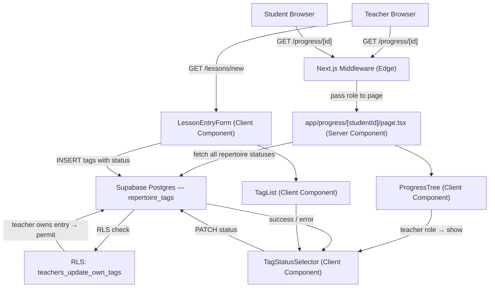

# Design Document: Repertoire Status Tracking

## Overview

This feature extends the Studio Architect platform with a richer repertoire status lifecycle. The changes span four layers:

1. **Database** — a migration adds `in_progress` to the `repertoire_tags.status` CHECK constraint and adds an UPDATE RLS policy for teachers.
2. **Type system** — `lib/types.ts` gains a `RepertoireStatus` union type; `RepertoireItem` and `ProgressTreeData` are updated to reflect all statuses.
3. **Lesson Entry Form** — `LessonEntryForm` and `TagList` gain a `TagStatusSelector` so teachers can choose a status per repertoire tag at lesson-entry time.
4. **Progress Tree** — `ProgressTree` is updated to fetch and display all repertoire statuses with distinct visual badges, and teachers get an inline selector to update a tag's status without creating a new lesson entry.

No new pages or route handlers are required. All changes are additive or in-place modifications to existing files.

---

## Architecture



### Key Design Decisions

- **No new API route for inline status update.** The `ProgressTree` client component calls the Supabase JS client directly. The RLS UPDATE policy enforces authorization at the DB layer.
- **`TagStatusSelector` is a shared component.** Both `TagList` (lesson form context) and `ProgressTree` (inline update context) render it.
- **`ProgressTreeData` shape change.** `mastered_repertoire: RepertoireItem[]` is renamed to `repertoire_items: RepertoireItem[]` and the query is broadened to return all statuses.
- **Grouping in the Progress Tree.** Items are grouped by status in the order `introduced → in_progress → mastered`, each with its own section heading and badge color.

---

## Components and Interfaces

### `TagStatusSelector` (new — `components/TagStatusSelector.tsx`)

```typescript
interface TagStatusSelectorProps {
  value: RepertoireStatus
  onChange: (status: RepertoireStatus) => void
  disabled?: boolean
}
```

Renders three `<option>` elements: `Introduced`, `In Progress`, `Mastered`. Theory items never receive this component.

### `TagList` update (`components/TagList.tsx`)

```typescript
type TagWithStatus = {
  item: CatalogItem
  status: RepertoireStatus | 'completed'
}

interface TagListProps {
  tags: TagWithStatus[]
  onRemove: (item: CatalogItem) => void
  onStatusChange: (item: CatalogItem, status: RepertoireStatus) => void
}
```

For each tag: if `item.type === 'repertoire'`, render `TagStatusSelector`; if `item.type === 'theory'`, render a static "Completed" label.

### `LessonEntryForm` update (`components/LessonEntryForm.tsx`)

Internal state changes from `CatalogItem[]` to `TagWithStatus[]`. The `handleSelect` callback initializes repertoire tags with `status: 'introduced'` and theory tags with `status: 'completed'`. The save handler maps `TagWithStatus[]` to the insert payload using each tag's current status.

### `ProgressTree` update (`components/ProgressTree.tsx`)

```typescript
interface ProgressTreeProps {
  data: ProgressTreeData
  role: 'teacher' | 'student'
}
```

For each repertoire item in teacher mode: render the item with its `StatusBadge`, render a `TagStatusSelector`, and on change optimistically update local state, call Supabase `update`, revert on error.

### `StatusBadge` — Tailwind classes per status

| Status | Badge style |
|---|---|
| `introduced` | `bg-gray-100 text-gray-600` |
| `in_progress` | `bg-amber-100 text-amber-700` |
| `mastered` | `bg-indigo-100 text-indigo-700` |
| `completed` (theory) | `bg-emerald-50 text-emerald-900` (unchanged) |

---

## Data Models

### Migration: `002_repertoire_status_in_progress.sql`

```sql
ALTER TABLE public.repertoire_tags
  DROP CONSTRAINT IF EXISTS repertoire_tags_status_check;

ALTER TABLE public.repertoire_tags
  ADD CONSTRAINT repertoire_tags_status_check
    CHECK (status IN ('introduced', 'in_progress', 'mastered', 'completed'));

CREATE POLICY "teachers_update_own_tags" ON public.repertoire_tags
  FOR UPDATE
  USING (
    EXISTS (
      SELECT 1 FROM public.lesson_entries le
      WHERE le.id = lesson_entry_id
        AND le.teacher_id = auth.uid()
    )
  )
  WITH CHECK (
    EXISTS (
      SELECT 1 FROM public.lesson_entries le
      WHERE le.id = lesson_entry_id
        AND le.teacher_id = auth.uid()
    )
  );
```

### Updated TypeScript types (`lib/types.ts`)

```typescript
export type RepertoireStatus = 'introduced' | 'in_progress' | 'mastered'

export type RepertoireItem = {
  id: string          // repertoire_tags.id
  title: string
  composer: string | null
  status: RepertoireStatus
}

export type ProgressTreeData = {
  repertoire_items: RepertoireItem[]   // renamed from mastered_repertoire
  completed_theory: TheoryItem[]
  lesson_entries?: Array<{ id: string; created_at: string; content: unknown }>
}
```

### Updated Progress Tree Query

The query broadens from filtering `status = 'mastered'` to returning all repertoire tags. De-duplication by `catalog_item.id` is retained (most-recent tag wins).

---

## Correctness Properties

### Property 1: Valid status values are accepted by the database

*For any* value in `('introduced', 'in_progress', 'mastered', 'completed')`, inserting a `repertoire_tags` row with that status SHALL succeed and the row SHALL be retrievable with the same status value.

**Validates: Requirements 1.2**

---

### Property 2: Invalid status values are rejected by the database

*For any* string not in `('introduced', 'in_progress', 'mastered', 'completed')`, inserting or updating a `repertoire_tags` row with that status SHALL fail with a constraint violation error.

**Validates: Requirements 1.3**

---

### Property 3: Status selection updates in-memory tag state

*For any* valid `RepertoireStatus` value, selecting it in the `TagStatusSelector` within the `LessonEntryForm` SHALL update the corresponding tag's in-memory status to exactly that value before the entry is saved.

**Validates: Requirements 3.3**

---

### Property 4: Lesson entry save persists the selected status

*For any* valid `RepertoireStatus` value, saving a lesson entry with a repertoire tag set to that status SHALL result in the `repertoire_tags` row having that exact status value.

**Validates: Requirements 3.4**

---

### Property 5: Progress tree displays all repertoire items regardless of status

*For any* student and any set of repertoire tags with any combination of valid statuses, the rendered `ProgressTree` SHALL display every item — none omitted due to status filtering.

**Validates: Requirements 4.1, 6.1**

---

### Property 6: Status badges are visually distinct across statuses

*For any* two different `RepertoireStatus` values, the rendered `StatusBadge` elements SHALL have different Tailwind class strings.

**Validates: Requirements 4.2**

---

### Property 7: Progress tree groups items by status

*For any* set of repertoire items spanning two or more distinct statuses, the rendered `ProgressTree` SHALL produce distinct section containers per status.

**Validates: Requirements 4.7**

---

### Property 8: Teacher view shows a selector on every repertoire item

*For any* non-empty list of repertoire items rendered in teacher mode, every item SHALL have a `TagStatusSelector` rendered alongside it.

**Validates: Requirements 5.1**

---

### Property 9: Student view never shows the status selector

*For any* progress tree data rendered in student mode, no `TagStatusSelector` element SHALL be present in the rendered output.

**Validates: Requirements 5.5**

---

### Property 10: Inline status update reaches the database

*For any* repertoire tag and any new valid `RepertoireStatus`, when a teacher selects the new status in the `ProgressTree` selector, the system SHALL issue a Supabase UPDATE for that tag's row with the new status value.

**Validates: Requirements 5.2, 5.3**

---

### Property 11: Progress tree query returns only the queried student's tags

*For any* two students with distinct repertoire tags, fetching the progress data for one student SHALL NOT include any `repertoire_tags` rows belonging to the other student.

**Validates: Requirements 6.4**

---

### Property 12: Teachers may UPDATE their own tags; students may not

*For any* `repertoire_tags` row on a lesson entry owned by a teacher, an UPDATE issued by that teacher SHALL succeed. *For any* `repertoire_tags` row, an UPDATE issued by a student-role user SHALL be rejected by RLS.

**Validates: Requirements 7.1, 7.2**

---

## Error Handling

| Scenario | Behavior |
|---|---|
| DB UPDATE succeeds (inline) | Optimistic state confirmed; badge re-renders with new status |
| DB UPDATE fails (inline) | Error message shown; `TagStatusSelector` reverts to pre-update status |
| Student attempts inline update | Selector not rendered (UI prevention); RLS rejects at DB layer |
| Theory item tagged in lesson form | `status: 'completed'` assigned automatically; no selector rendered |
| DB INSERT fails in lesson form | Existing error handling surfaces error; form state (including statuses) preserved |

---

## Testing Strategy

### Unit Tests

- `TagStatusSelector` renders exactly three options with correct labels (Req 3.2)
- `TagList` shows `TagStatusSelector` for repertoire items, hides for theory items (Req 3.5)
- `ProgressTree` in teacher mode renders `TagStatusSelector` on each repertoire item (Req 5.1)
- `ProgressTree` in student mode renders no `TagStatusSelector` (Req 5.5)
- `StatusBadge` applies correct Tailwind classes per status (Req 4.3, 4.4, 4.5)
- DB update failure shows error and reverts selector (Req 5.4)

### Property-Based Tests

Using **fast-check**. Minimum 100 iterations each.

Tag format: `// Feature: repertoire-status-tracking, Property N: <property_text>`

| Property | Generator | Assertion |
|---|---|---|
| P1: Valid status accepted | Arbitrary value from valid set | Insert succeeds; retrieved row has same status |
| P2: Invalid status rejected | Arbitrary string not in valid set | Insert throws constraint violation |
| P3: Status selection updates state | Arbitrary `RepertoireStatus` | In-memory tag status equals selected value |
| P4: Save persists selected status | Arbitrary `RepertoireStatus` × tag | Persisted row status equals selected value |
| P5: All repertoire items displayed | Arbitrary `RepertoireItem[]` with mixed statuses | All items appear in rendered output |
| P6: Badges are visually distinct | Arbitrary pair of distinct statuses | Badge class strings differ |
| P7: Items grouped by status | Arbitrary items spanning ≥2 statuses | Distinct section containers per status |
| P8: Teacher sees selector on every item | Arbitrary non-empty items in teacher mode | Every item has a `TagStatusSelector` |
| P9: Student sees no selector | Arbitrary data in student mode | No `TagStatusSelector` in rendered output |
| P10: Inline update issues DB call | Arbitrary tag id × new status | Supabase `update` called with correct args |
| P11: Query isolation between students | Arbitrary two students with distinct tags | Student A's query returns no tags from student B |
| P12: RLS permits teacher, rejects student | Arbitrary tag owned by teacher | Teacher UPDATE succeeds; student UPDATE rejected |

### Integration Tests

- Migration applies cleanly; existing rows preserved (Req 1.4)
- Teacher-role session can UPDATE a `repertoire_tags` row (Req 7.1)
- Student-role session is blocked by RLS on UPDATE (Req 7.2)
- Existing INSERT and SELECT policies still function after migration (Req 7.3)
