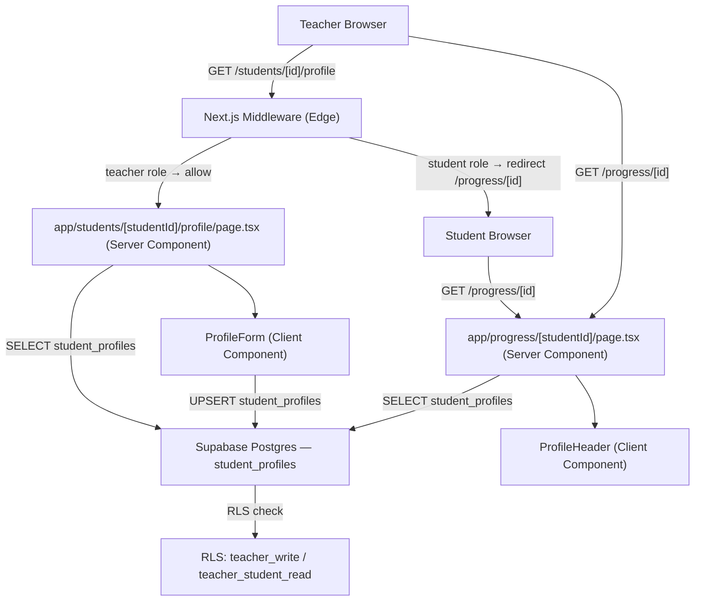

# Design Document: Student Profile Goals

## Overview

This feature adds a dedicated student profile to Studio Architect. A new `student_profiles` table stores three fields per student — `grade_level`, `instrument`, and `goals` — linked one-to-one to the existing `profiles` table. Teachers edit this data at a new page `/students/[studentId]/profile`. The data is surfaced as a read-only `ProfileHeader` component at the top of the existing Progress Tree page (`/progress/[studentId]`), giving both teachers and students immediate context when reviewing progress.

The changes are additive: one new migration, one new page, one new component, and targeted modifications to the Progress Tree page and the Teacher Dashboard.

### Key Design Decisions

| Decision | Choice | Rationale |
|---|---|---|
| Separate table vs. columns on `profiles` | Separate `student_profiles` table | Keeps auth-profile table lean; profile data can be queried independently; one-to-one FK is explicit |
| Upsert strategy | `INSERT ... ON CONFLICT (student_id) DO UPDATE` | Idempotent; no need to check existence before write; single round-trip |
| `updated_at` automation | Postgres trigger | Consistent with existing schema patterns; no application-layer clock skew |
| Profile edit route | `/students/[studentId]/profile` | Distinct from `/progress/[studentId]` to keep read and write surfaces separate |
| Profile display on Progress Tree | Server Component data fetch + `ProfileHeader` client component | Consistent with existing page architecture; no extra client-side fetch |

---

## Architecture



### Request Lifecycle — Profile Edit

1. Teacher navigates to `/students/[studentId]/profile`.
2. Middleware validates JWT, confirms `role = 'teacher'`; students are redirected to `/progress/[id]`.
3. Server Component fetches the existing `student_profiles` row (or null) for the given `studentId`.
4. Page renders `ProfileForm` pre-populated with fetched values.
5. Teacher submits the form; `ProfileForm` calls a Server Action that issues an upsert.
6. On success, the Server Action revalidates the path and returns a success flag; the form shows a confirmation message.

### Request Lifecycle — Progress Tree (Profile Header)

1. Teacher or student navigates to `/progress/[studentId]`.
2. Server Component fetches both progress data and the `student_profiles` row in parallel.
3. `ProfileHeader` is rendered above the existing `ProgressTree` component with the fetched profile data (or null).

---

## Components and Interfaces

### `ProfileHeader` (`components/ProfileHeader.tsx`)

Read-only display component. Renders at the top of the Progress Tree page.

```typescript
interface StudentProfile {
  grade_level: string | null
  instrument: string | null
  goals: string | null
}

interface ProfileHeaderProps {
  profile: StudentProfile | null
}
```

When `profile` is null or all fields are null/empty, renders a placeholder: "No profile set yet."

### `ProfileForm` (`components/ProfileForm.tsx`)

Client Component. Handles the teacher-facing edit form.

```typescript
interface ProfileFormProps {
  studentId: string
  initialProfile: StudentProfile | null
}
```

Internal state mirrors the three fields. On submit, calls the `upsertStudentProfile` Server Action. Displays a success banner on save or an inline validation error if all fields are empty.

### `upsertStudentProfile` Server Action (`app/students/[studentId]/profile/actions.ts`)

```typescript
type UpsertResult =
  | { success: true }
  | { success: false; error: string }

async function upsertStudentProfile(
  studentId: string,
  data: { grade_level: string; instrument: string; goals: string }
): Promise<UpsertResult>
```

Validates that at least one field is non-empty. Issues an upsert against `student_profiles`. Sets `updated_by` to `auth.uid()`. Calls `revalidatePath` for both the profile page and the progress page.

### Profile Page (`app/students/[studentId]/profile/page.tsx`)

Server Component. Fetches the existing profile and the student's `full_name` (for the page heading). Verifies the student is assigned to the requesting teacher — returns 404 otherwise.

### Progress Tree Page update (`app/progress/[studentId]/page.tsx`)

Adds a parallel fetch for `student_profiles` alongside the existing progress data fetch. Passes the result to `ProfileHeader` rendered above `<Suspense>`.

### Dashboard update (`app/dashboard/page.tsx`)

Adds a "Edit Profile" link per student row pointing to `/students/[studentId]/profile`.

### Middleware update (`middleware.ts`)

Adds `/students` to the set of protected routes. Adds `/students/[studentId]/profile` to the teacher-only route check.

---

## Data Models

### `student_profiles` table

| Column | Type | Notes |
|---|---|---|
| `student_id` | `uuid` | PK + FK → `profiles.id` ON DELETE CASCADE |
| `grade_level` | `text` | Nullable |
| `instrument` | `text` | Nullable |
| `goals` | `text` | Nullable |
| `updated_at` | `timestamptz` | Set by trigger on insert/update |
| `updated_by` | `uuid` | FK → `profiles.id`; the teacher who last saved |

`student_id` is both the primary key and the unique constraint, enforcing the one-to-one relationship.

### Migration: `003_student_profiles.sql`

```sql
CREATE TABLE IF NOT EXISTS public.student_profiles (
  student_id   uuid        PRIMARY KEY REFERENCES public.profiles (id) ON DELETE CASCADE,
  grade_level  text,
  instrument   text,
  goals        text,
  updated_at   timestamptz NOT NULL DEFAULT now(),
  updated_by   uuid        REFERENCES public.profiles (id) ON DELETE SET NULL
);

-- Trigger to keep updated_at current
CREATE OR REPLACE FUNCTION public.set_updated_at()
RETURNS trigger LANGUAGE plpgsql AS $$
BEGIN
  NEW.updated_at = now();
  RETURN NEW;
END;
$$;

CREATE TRIGGER student_profiles_updated_at
  BEFORE INSERT OR UPDATE ON public.student_profiles
  FOR EACH ROW EXECUTE FUNCTION public.set_updated_at();

-- RLS
ALTER TABLE public.student_profiles ENABLE ROW LEVEL SECURITY;

-- Assigned teacher can read and write
CREATE POLICY "teacher_read_write_profile" ON public.student_profiles
  FOR ALL
  USING (
    EXISTS (
      SELECT 1 FROM public.profiles p
      WHERE p.id = student_id
        AND p.teacher_id = auth.uid()
    )
  )
  WITH CHECK (
    EXISTS (
      SELECT 1 FROM public.profiles p
      WHERE p.id = student_id
        AND p.teacher_id = auth.uid()
    )
  );

-- Student can read their own profile
CREATE POLICY "student_read_own_profile" ON public.student_profiles
  FOR SELECT
  USING (student_id = auth.uid());
```

### Updated TypeScript types (`lib/types.ts`)

```typescript
export type StudentProfile = {
  grade_level: string | null
  instrument: string | null
  goals: string | null
}
```

---

## Correctness Properties

*A property is a characteristic or behavior that should hold true across all valid executions of a system — essentially, a formal statement about what the system should do. Properties serve as the bridge between human-readable specifications and machine-verifiable correctness guarantees.*

### Property 1: Profile data round-trip integrity

*For any* valid combination of `grade_level`, `instrument`, and `goals` strings, upserting a `student_profiles` record and then retrieving it SHALL return values identical to those that were submitted — no field truncated, mutated, or lost.

**Validates: Requirements 6.1**

---

### Property 2: student_id is preserved across updates

*For any* `student_profiles` record, performing an update with new field values SHALL leave the `student_id` foreign key unchanged in the retrieved record.

**Validates: Requirements 6.2**

---

### Property 3: RLS enforces correct read/write access

*For any* (teacher, student, unrelated_teacher) triple where the teacher is assigned to the student, the assigned teacher SHALL be able to SELECT and UPSERT the student's profile row, the student SHALL be able to SELECT but not INSERT or UPDATE their own row, and the unrelated teacher SHALL be blocked from both SELECT and INSERT/UPDATE.

**Validates: Requirements 1.4**

---

### Property 4: Profile_Page form pre-populated with stored values

*For any* `StudentProfile` record (including null/missing), rendering the Profile_Page SHALL produce form fields whose values match the stored `grade_level`, `instrument`, and `goals` — or empty strings when no record exists.

**Validates: Requirements 2.1**

---

### Property 5: Upsert succeeds for any non-empty field combination

*For any* combination of `grade_level`, `instrument`, and `goals` where at least one field is non-empty, submitting the profile form SHALL result in a successful upsert and a success confirmation being rendered.

**Validates: Requirements 2.3**

---

### Property 6: Middleware blocks non-teachers from the profile page

*For any* `studentId`, a request to `/students/[studentId]/profile` with a student-role session SHALL always be redirected to the student's own Progress_Tree, and a request with a teacher-role session SHALL always be allowed through.

**Validates: Requirements 2.5, 4.3**

---

### Property 7: Profile_Header renders all three fields for any profile

*For any* `StudentProfile` record with non-null values, the rendered `ProfileHeader` SHALL contain the `grade_level`, `instrument`, and `goals` values as visible text.

**Validates: Requirements 3.1, 4.1**

---

### Property 8: Dashboard profile link present for every student

*For any* non-empty list of students assigned to a teacher, every rendered dashboard row SHALL contain a link pointing to `/students/[studentId]/profile` for that student.

**Validates: Requirements 5.1**

---

## Error Handling

| Scenario | Behavior |
|---|---|
| All profile fields empty on submit | Client-side validation error before any DB call; form state preserved |
| Upsert DB failure | Server Action returns `{ success: false, error }`; form shows inline error; no navigation |
| Student accesses `/students/[id]/profile` | Middleware redirects to `/progress/[studentId]` |
| Teacher accesses profile for unassigned student | Server Component returns 404 (Next.js `notFound()`) |
| No `student_profiles` row exists | `ProfileHeader` renders placeholder; `ProfileForm` renders empty fields |
| `updated_at` trigger missing | Upsert still succeeds; `updated_at` falls back to `DEFAULT now()` on insert |

---

## Testing Strategy

### Unit Tests (example-based)

- `ProfileHeader` renders placeholder when `profile` is null (Req 3.2)
- `ProfileHeader` renders all three field values when profile is present (Req 3.1)
- `ProfileHeader` contains no input, textarea, or edit button elements (Req 3.3)
- `ProfileForm` renders text input for `grade_level`, text input for `instrument`, textarea for `goals` (Req 2.2)
- `ProfileForm` shows validation error when all fields are submitted empty (Req 2.4)
- Dashboard row renders profile link alongside `full_name` and `last_lesson_date` (Req 5.2)
- Middleware redirects student-role session from `/students/[id]/profile` (Req 2.6)
- Server Component returns 404 for unassigned student (Req 2.7)

### Property-Based Tests

Using **fast-check** (TypeScript PBT library). Each test runs a minimum of **100 iterations**.

Tag format: `// Feature: student-profile-goals, Property N: <property_text>`

| Property | Generator | Assertion |
|---|---|---|
| P1: Round-trip integrity | Arbitrary `(grade_level, instrument, goals)` string triples | Retrieved record fields equal submitted values |
| P2: student_id preserved on update | Arbitrary profile updates | `student_id` in retrieved record equals original |
| P3: RLS access rules | Arbitrary (teacher, student, unrelated_teacher) triples | Assigned teacher: read+write ✓; student: read ✓, write ✗; unrelated teacher: read ✗, write ✗ |
| P4: Form pre-populated | Arbitrary `StudentProfile` (including null) | Form field values match stored values or are empty |
| P5: Upsert on non-empty submission | Arbitrary field combos with ≥1 non-empty | Upsert called; success confirmation rendered |
| P6: Middleware role enforcement | Arbitrary `studentId` values | Teacher-role → allowed; student-role → redirected |
| P7: Profile_Header field display | Arbitrary `StudentProfile` with non-null values | Rendered output contains all three field values |
| P8: Dashboard profile link per student | Arbitrary non-empty student lists | Every row has a link to `/students/[id]/profile` |

### Integration Tests

- Migration applies cleanly; `student_profiles` table created with correct schema (Req 1.1)
- Unique constraint on `student_id` rejects duplicate inserts (Req 1.2)
- `updated_at` trigger fires on insert and update (Req 1.3)
- Teacher-role session can upsert a `student_profiles` row via the Server Action (Req 2.3)
- Student-role session is blocked by RLS on INSERT/UPDATE (Req 1.4)
- Progress Tree page renders `ProfileHeader` above progress content (Req 3.1)
