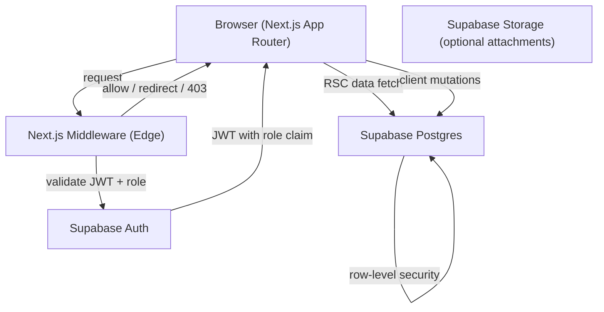

# Design Document: Studio Architect

## Overview

Studio Architect is a role-based B2B SaaS platform for music conservatories. It is built on **Next.js 14 (App Router)**, **Tailwind CSS**, and **Supabase** (Auth + Postgres). The platform has two user roles — teacher and student — with distinct access patterns:

- Teachers create lesson entries, tag repertoire, and view all their students' progress.
- Students read their own progress tree.

The core data flow is: Teacher authenticates → creates Lesson Entries with rich-text notes and Repertoire Tags → those tags propagate to the student's Progress Tree.

### Key Technology Choices

| Concern | Choice | Rationale |
|---|---|---|
| Auth & session | Supabase Auth (JWT) | Built-in role claims, SSR session helpers |
| Route protection | Next.js Middleware | Edge-runtime, runs before page render |
| Rich-text editor | Tiptap (ProseMirror-based) | Notion-style UX, JSON serialization, extensible |
| Rich-text storage | JSON (Tiptap `JSONContent`) | Structured, round-trippable, queryable |
| Catalog search | Postgres full-text search via Supabase | Sub-300ms for ≤10k rows without extra infra |
| Progress Tree UI | React + SVG / CSS tree layout | Lightweight, no heavy graph library needed |

---

## Architecture



### Request Lifecycle

1. Browser sends request to any route.
2. Next.js Middleware reads the Supabase session cookie, validates the JWT, and extracts the `role` claim.
3. Middleware enforces authentication (all `/dashboard`, `/lessons`) and authorization (teacher-only `/lessons/new`, `/lessons/[id]/edit`).
4. Page components (React Server Components) fetch data directly from Supabase using the server-side client.
5. Client components handle interactive mutations (save lesson entry, search catalog).

### Row-Level Security (RLS)

Supabase RLS policies enforce data isolation at the database layer as a second line of defense:

- `lesson_entries`: teachers can read/write their own entries; students can read entries where `student_id = auth.uid()`.
- `repertoire_tags`: same scoping as lesson entries.
- `students`: teachers can read students assigned to them; students can read their own row.

---

## Components and Interfaces

### Next.js Middleware (`middleware.ts`)

```typescript
// Runs at the Edge before every request
export async function middleware(request: NextRequest): Promise<NextResponse>
```

Responsibilities:
- Create a Supabase server client from the request cookies.
- Refresh the session if needed (Supabase SSR helper).
- Redirect unauthenticated users hitting `/dashboard/**` or `/lessons/**` to `/login`.
- Return 403 + redirect to `/progress` for students hitting `/lessons/new` or `/lessons/[id]/edit`.

### Auth Module

```typescript
// lib/auth.ts
export async function getSession(): Promise<Session | null>
export async function getUserRole(): Promise<"teacher" | "student" | null>
export async function signIn(email: string, password: string): Promise<AuthResult>
export async function signOut(): Promise<void>
```

Role is stored as a custom claim in the Supabase JWT via a `profiles` table and a database trigger that sets `app_metadata.role` on user creation.

### Teacher Dashboard (`app/dashboard/page.tsx`)

Server Component. Fetches the list of students assigned to the authenticated teacher, including each student's most recent lesson entry date.

```typescript
// Data fetching shape
type StudentSummary = {
  id: string
  full_name: string
  last_lesson_date: string | null
}
```

### Progress Tree (`app/progress/[studentId]/page.tsx`)

Server Component (initial load) + Client Component (interactive tree). Fetches all mastered repertoire tags and completed theory assignments for the given student.

```typescript
type ProgressTreeData = {
  mastered_repertoire: RepertoireItem[]
  completed_theory: TheoryItem[]
}
```

### Lesson Entry Form (`app/lessons/new/page.tsx`, `app/lessons/[id]/edit/page.tsx`)

Client Component. Contains:
- `TiptapEditor` — the rich-text editor component.
- `RepertoireCatalogSearch` — debounced search input + results list.
- `TagList` — currently selected tags.
- Save / cancel actions.

```typescript
// Editor component interface
interface TiptapEditorProps {
  initialContent?: JSONContent
  onChange: (content: JSONContent) => void
}

// Catalog search interface
interface RepertoireCatalogSearchProps {
  onSelect: (item: CatalogItem) => void
}
```

### Repertoire Catalog Search

Client-side debounced fetch to a Next.js Route Handler:

```
GET /api/catalog/search?q={query}
→ CatalogItem[]
```

The Route Handler queries Postgres using `to_tsvector` / `plainto_tsquery` for full-text search, falling back to `ILIKE` for short queries.

---

## Data Models

### `profiles` table

| Column | Type | Notes |
|---|---|---|
| `id` | `uuid` | FK → `auth.users.id` |
| `full_name` | `text` | |
| `role` | `text` | `'teacher'` or `'student'` |
| `teacher_id` | `uuid` | NULL for teachers; FK → `profiles.id` for students |

### `lesson_entries` table

| Column | Type | Notes |
|---|---|---|
| `id` | `uuid` | PK |
| `teacher_id` | `uuid` | FK → `profiles.id` |
| `student_id` | `uuid` | FK → `profiles.id` |
| `content` | `jsonb` | Tiptap `JSONContent` document |
| `created_at` | `timestamptz` | Set by DB default |

### `catalog_items` table

| Column | Type | Notes |
|---|---|---|
| `id` | `uuid` | PK |
| `title` | `text` | Piece or assignment name |
| `type` | `text` | `'repertoire'` or `'theory'` |
| `composer` | `text` | NULL for theory items |
| `search_vector` | `tsvector` | Generated column for FTS |

### `repertoire_tags` table

| Column | Type | Notes |
|---|---|---|
| `id` | `uuid` | PK |
| `lesson_entry_id` | `uuid` | FK → `lesson_entries.id` |
| `catalog_item_id` | `uuid` | FK → `catalog_items.id` |
| `status` | `text` | `'introduced'`, `'mastered'`, `'completed'` |

### Rich-Text Content Schema

Lesson entry notes are stored as Tiptap `JSONContent` — a recursive node tree:

```typescript
type JSONContent = {
  type: string           // e.g. "doc", "paragraph", "heading", "bulletList"
  attrs?: Record<string, unknown>
  content?: JSONContent[]
  marks?: Array<{ type: string; attrs?: Record<string, unknown> }>
  text?: string
}
```

Supported node types: `doc`, `paragraph`, `heading` (levels 1–3), `bulletList`, `orderedList`, `listItem`, `bold` mark, `italic` mark.


---

## Correctness Properties

*A property is a characteristic or behavior that should hold true across all valid executions of a system — essentially, a formal statement about what the system should do. Properties serve as the bridge between human-readable specifications and machine-verifiable correctness guarantees.*

### Property 1: Unauthenticated requests to protected routes are always redirected

*For any* path under `/dashboard/**` or `/lessons/**`, a request with no valid session cookie SHALL always result in a redirect to `/login`, regardless of the specific sub-path.

**Validates: Requirements 1.5, 1.6**

---

### Property 2: Middleware enforces role-based access on teacher-only routes

*For any* lesson ID, a request to `/lessons/new` or `/lessons/[id]/edit` with a student-role session SHALL always be rejected (403 + redirect to `/progress`), and the same request with a teacher-role session SHALL always be allowed through.

**Validates: Requirements 2.1, 2.2, 2.3**

---

### Property 3: Dashboard returns exactly the teacher's assigned students

*For any* teacher and any set of students assigned to that teacher, the dashboard data query SHALL return all and only those students — no students from other teachers, and no assigned students omitted.

**Validates: Requirements 3.1**

---

### Property 4: Dashboard student rows contain all required display fields

*For any* student assigned to a teacher, the rendered dashboard row SHALL contain the student's full name and their most recent lesson entry date (or a null/empty indicator if no entries exist).

**Validates: Requirements 3.2**

---

### Property 5: Progress tree returns all and only the correct items for a student

*For any* student and any set of repertoire tags and theory assignments in the database, the progress tree query SHALL return all items marked as "mastered" (for repertoire) or "completed" (for theory) for that student, and SHALL NOT return items belonging to other students or items with other statuses.

**Validates: Requirements 4.1, 4.2, 4.4**

---

### Property 6: Progress tree visually distinguishes item types

*For any* progress tree data containing both mastered repertoire items and completed theory items, the rendered output SHALL apply distinct visual markers (e.g., different CSS classes or icons) to each type, such that no mastered repertoire item is rendered identically to a completed theory item.

**Validates: Requirements 4.3**

---

### Property 7: Rich-text editor accepts all required format types

*For any* text content, applying each of the required formats (bold, italic, bullet list, numbered list, heading) SHALL produce a valid `JSONContent` document containing the corresponding node or mark type without error.

**Validates: Requirements 5.2**

---

### Property 8: Saved lesson entry preserves all required fields

*For any* valid lesson entry (any rich-text content, any set of repertoire tags, any teacher/student pair), after persisting and retrieving the entry, the retrieved record SHALL contain the original teacher ID, student ID, rich-text content, creation timestamp, and all selected repertoire tags — none omitted or altered.

**Validates: Requirements 5.3**

---

### Property 9: Repertoire tag add/remove round-trip

*For any* catalog item and any lesson entry tag list, adding the item to the tag list and then removing it SHALL leave the tag list in the same state as before the addition — the operation is a round-trip identity.

**Validates: Requirements 6.3, 6.4**

---

### Property 10: Saving a lesson entry propagates tags to the progress tree

*For any* lesson entry containing any set of repertoire tags, after the entry is saved, the student's progress tree query SHALL include all of those tags with their correct statuses.

**Validates: Requirements 6.5**

---

### Property 11: Rich-text content round-trip integrity

*For any* valid Tiptap `JSONContent` document, serializing it to JSONB (for storage) and then deserializing it SHALL produce a structurally equivalent document — no nodes, marks, attributes, or text content lost or mutated.

**Validates: Requirements 7.1, 7.2**

---

## Error Handling

### Authentication Errors

| Scenario | Behavior |
|---|---|
| Invalid credentials | Display inline error on login form; no session created |
| Expired session | Middleware detects missing/invalid JWT; redirect to `/login` |
| Missing role claim | Treat as unauthenticated; redirect to `/login` |

### Authorization Errors

| Scenario | Behavior |
|---|---|
| Student accesses teacher route | 403 response + redirect to `/progress` |
| Teacher accesses another teacher's student data | RLS policy blocks at DB layer; return empty result or 404 |

### Lesson Entry Errors

| Scenario | Behavior |
|---|---|
| Empty content + no tags | Client-side validation error before submission; no network request |
| DB write failure | Display toast error; keep form state intact so teacher doesn't lose work |
| Catalog search failure | Display inline error in search component; allow manual retry |

### Rich-Text Errors

| Scenario | Behavior |
|---|---|
| Malformed JSONB on retrieval | Log error server-side; render empty editor with error banner rather than crashing |
| Unknown node type in stored content | Tiptap renders unknown nodes as plain text (graceful degradation) |

---

## Testing Strategy

### Unit Tests (example-based)

Focus on specific behaviors and edge cases:

- Login form renders error on invalid credentials (Req 1.3)
- Middleware redirects unauthenticated requests (Req 1.4, 1.6)
- Dashboard shows empty-state when teacher has no students (Req 3.5)
- Progress tree shows empty-state when student has no items (Req 4.6)
- Lesson entry form shows validation error on empty submit (Req 5.4)
- Successful save navigates to progress tree (Req 5.5)
- Catalog search input is present on lesson form (Req 6.1)
- Saved lesson entry renders correctly in editor (Req 7.3)

### Property-Based Tests

Using **fast-check** (TypeScript PBT library). Each test runs a minimum of **100 iterations**.

Tag format: `// Feature: studio-architect, Property N: <property_text>`

| Property | Generator | Assertion |
|---|---|---|
| P1: Unauthenticated redirect | Arbitrary sub-paths under `/dashboard` and `/lessons` | Middleware always returns redirect to `/login` |
| P2: Role-based middleware | Arbitrary lesson IDs × role (`teacher`/`student`) | Student → 403; Teacher → allowed |
| P3: Dashboard student completeness | Arbitrary teacher + student assignment sets | Query returns exactly the assigned set |
| P4: Dashboard row fields | Arbitrary student records | Rendered row contains `full_name` and `last_lesson_date` |
| P5: Progress tree completeness | Arbitrary student + tag sets with mixed statuses | Query returns all and only mastered/completed items for that student |
| P6: Progress tree visual distinction | Arbitrary mixed progress tree data | Rendered output uses distinct markers per type |
| P7: Editor format support | Arbitrary text content × format type | Applying format produces valid JSONContent with correct node/mark |
| P8: Lesson entry field preservation | Arbitrary lesson entries (content + tags + IDs) | Retrieved record equals saved record on all required fields |
| P9: Tag add/remove round-trip | Arbitrary tag list + catalog item | add(item) then remove(item) = original list |
| P10: Tag propagation to progress tree | Arbitrary lesson entries with tags | After save, progress tree contains all entry tags |
| P11: Rich-text round-trip | Arbitrary valid JSONContent trees | deserialize(serialize(doc)) ≡ doc |

### Integration Tests

- Sign in with seeded teacher/student accounts; verify role claim in session (Req 1.2)
- Catalog search against 10k-row seeded DB; verify response time ≤ 300ms (Req 6.2)
- End-to-end: create lesson entry → verify progress tree updated (Req 6.5)

### Smoke Tests

- Profiles table has `CHECK (role IN ('teacher', 'student'))` constraint (Req 1.1)
- RLS policies are enabled on all relevant tables
